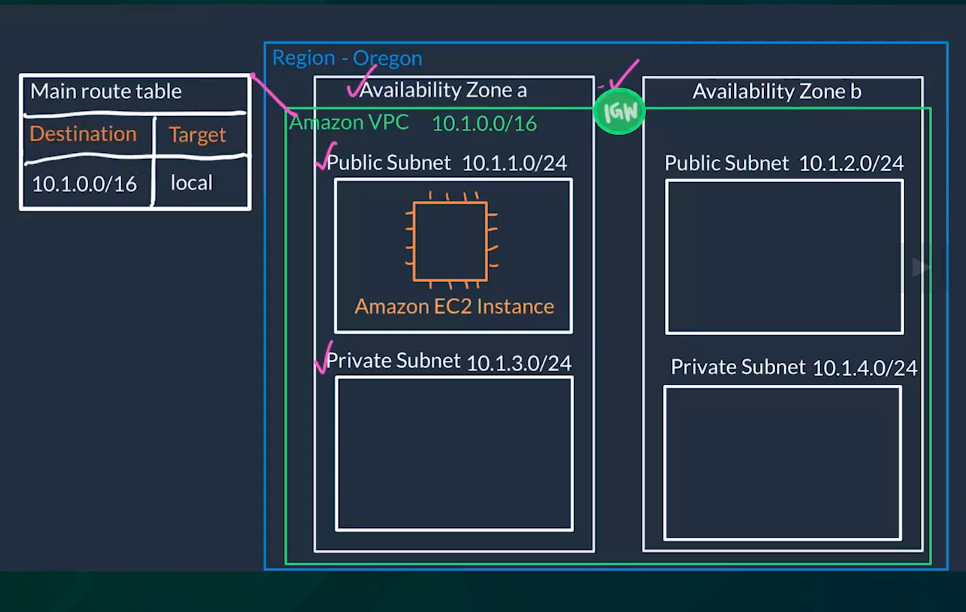

Chào mọi người, bài viết này mình sẽ giới thiệu những tìm hiểu của mình về **AWS VPC**

:spider:

## Concepts
### VPC
**VPC** (virtual private cloud) là một môi trường mạng riêng ảo, được xây dựng làm nơi đặt các tài nguyên của AWS (EC2, RDS, ...) bên trong đó, giúp kiểm soát toàn bộ môi trường mạng ảo bao quanh các tài nguyên này (lựa chọn phạm vi địa chỉ IP (IPv4 & IPv6), tạo các mạng con (`Subnet`), và cấu hình các bảng định tuyến (`Route Tables`), cổng mạng (`Gatewall`))
### Subnet
**Subnets** là các mạng con, các dải địa chỉ IP nằm trong `VPC`, nơi bạn đặt các tài nguyên vào trong đó, có thể kiểm soát việc tài nguyên trong các `subnet` có thể connect tới internet hoặc không bằng việc chia các `subnet` thành loại  **public subnet** hay **private subnet**
### Internet Gateway
* Các `subnet` thường được chia theo 2 loại `public subnet` hoặc `private subnet`, `public subnet` là nơi đặt các resource (EC2) có thể truy cập được từ mạng intenet bên ngoài
* Để cho phép internet access từ bên ngoài, bạn cần tạo một **Internet Gateway**, gắn nó vào `VPC` của bạn, gắn **Route Table** cho `public subnet` để enable internet traffic tới **Internet Gateway**, `public subnet` cần có một public IP và cần config **Network ACL** và **Security group** cho phép traffic đi vào / đi ra từ instance của bạn
### Route Table
**Route Table** giúp bạn kiếm soát được `network traffic` từ các `subnet`
* `Route table` chứa các `rules` (`routes`), mỗi `rule` bao gồm `Destination` (Địa chỉ IP cho phép traffic tới) và `Target` (Gateway, network interface nơi traffic gửi tới `Destination`)
* Khi tạo `VPC`, `AWS` sẽ gắn một `route table` cho `VPC` mới này (`Main route table`)

* Bạn có thể tạo một `Route table`, gắn `Target` tới một `Internet Gateway` đã được gắn với `VPC` của bạn, và gắn nó là **Subnet associations** cho `public subnet` của bạn, sau khi cấu hình xong, `public subnet` có thể được access từ bên ngoài thông qua `Internet Gateway`
### Network ACL
**Network ACL** (`network access control list`) là một lớp bảo mật cho `VPC` (kiểu Firewall) nhằm kiểm soát traffic ra/vào các `subnets` bên trong `VPC`
* `VPC` mặc định được gắn với một `Network ACL` mặc định, `Network ACL` này cho phép mọi traffic ra/vào `VPC` của bạn
* Bạn có thể tạo custom `Network ACL` riêng và gắn nó với một `subnet` mong muốn. Các custom `Network ACL` mặc định sẽ từ chối mọi traffic vào/ra nếu không có `rule` nào được thêm vào
* Các `subnet` nếu không được gắn với một `Network ACL` nào, nó sẽ mặc định nhận `Network ACL` của `VPC`
* Bao gồm `Inbound rules` (các `rule` cho phép protocol, port, IP range nào được phép gửi request tới `VPC`) và `Outbound rules` (các `rule` cho phép protocol, port, IP Range nào mà các resource bên trong `VPC` có thể gửi request tới (bên ngoài))

---

Tóm lại
* Mọi traffic ra/vào `VPC` của bạn cần phải pass qua các rule của `Network ACL` (`Network ACL` default của `VPC`, và `Network ACL` (nếu có) của từng `subnet` bên trong)
* Tiếp theo cần phải match các `route` trong `Route Table` tương ứng, nếu muốn tới `public subnet` thì trong `Route Table` phải có `route` `Target` tới một `Internet Gateway`
## Example
Trong phần ví dụ, mình sẽ tạo 1 `VPC` đơn giản, hình minh họa như bên dưới:

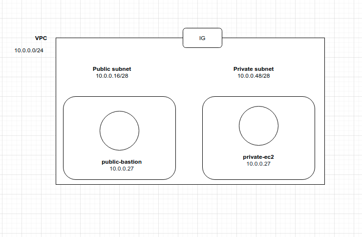

### Tạo VPC
Mình tạo 1 VPC mới: `vpc-01`

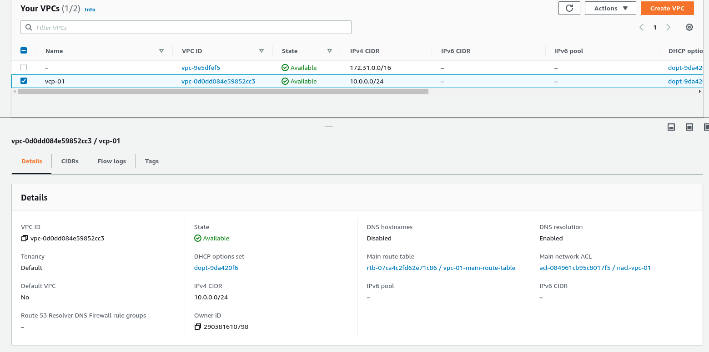

Mặc định `AWS` sẽ gắn một `Main Route Table`, `Main Network ACL` cho `VPC` mới tạo, ở đây mình đặt lại tên cho chúng: `vpc-01-main-route-table`, `nacl-vpc-01`

* `Main Route Table`:

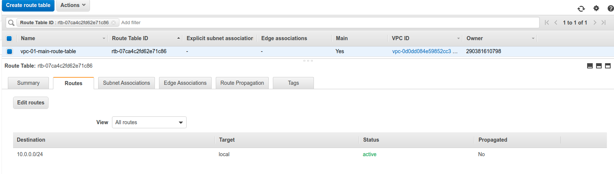

Mặc định `Destination` là là IP của `vpc-01`: `10.0.0.0/24`, `Target` là `local`, nghĩa là RouteTable cho phép mọi resource trong `vpc-01` có thể kết nối với nhau

* `Main Network ACL`:

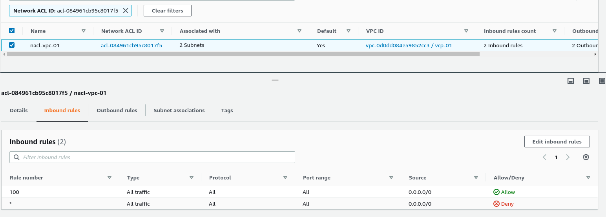

`Inbound rules` và `Outbound rules` được đặt mặc định cho phép mọi kết nối tới `vpc-01`

### Tạo Internet Gateway

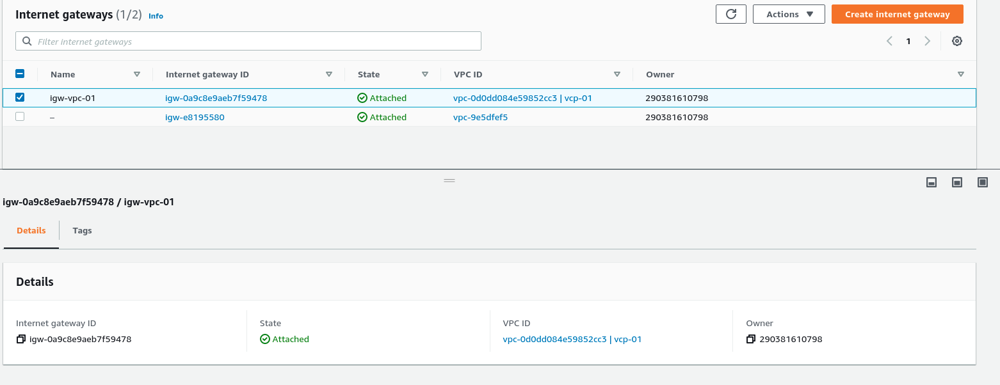

`igw-0a9c8e9aeb7f59478` được gán với `vpc-01`

### Tạo public subnet và private subnet

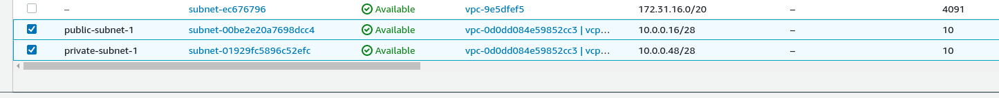

* `public subnet` (`public-subnet-1`) mình chọn dải IP là (`10.0.0.16/28`)
  - Nếu không gắn `Network ACL` cho `subnet` nào thì `subnet` sẽ hiển thị `Network ACL` là `nacl-vpc-01` của `vpc-01`, nghĩa là nếu traffic qua được `vpc-01` thì có thể vào được `subnet` này
  - `public-subnet-1` được gán với một custom `Route Table` `public-subnet-route-table-vpc-01`:

  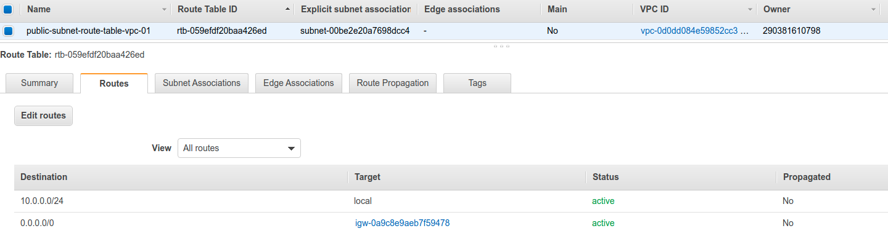
  `Destination` là là IP của `public-subnet-1`: `10.0.0.16/24`, `Target` là `igw-0a9c8e9aeb7f59478`, nghĩa là `public-subnet-route-table-vpc-01` cho phép traffic từ bên ngoài tới `public-subnet-1`

* `private-subnet-1` mặc định không custom gì cả, sẽ hiển thị `vcp-01-main-route-table` và `nacl-vpc-01` của `vpc-01`

### Tạo EC2 instance bên trong public subnet và private subnet

* `public-bastion`nằm trong `public-subnet-1`, được gán `Elastic IP` (`18.190.167.254`)

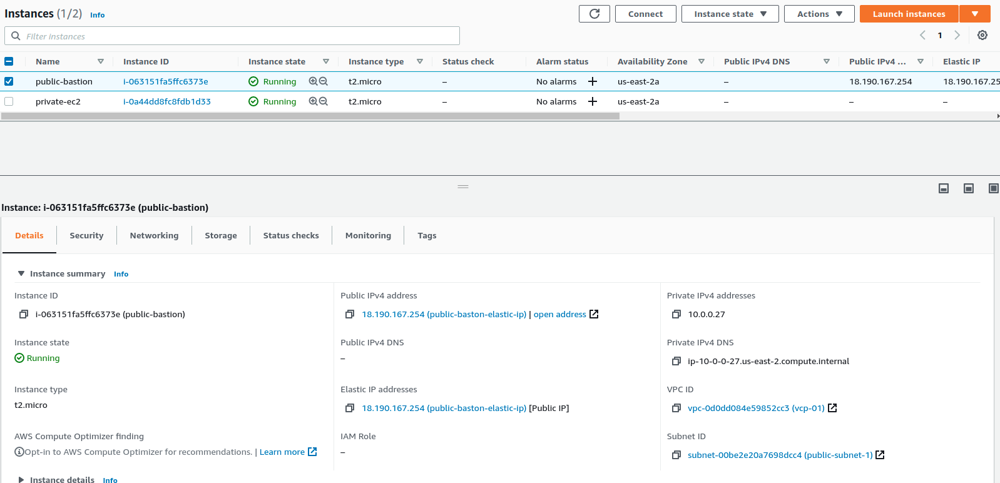

Với `Security groups` instance `Inbound rules` enable `SSH` và `HTTP/HTTPS` protocol

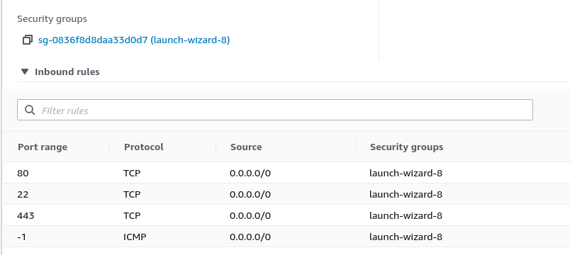

* `private-ec2` nằm trong `private-subnet-1`, cũng config `Security groups` tương tự với `public-bastion`

### Test VPC

* SSH tới `public-bastion`:

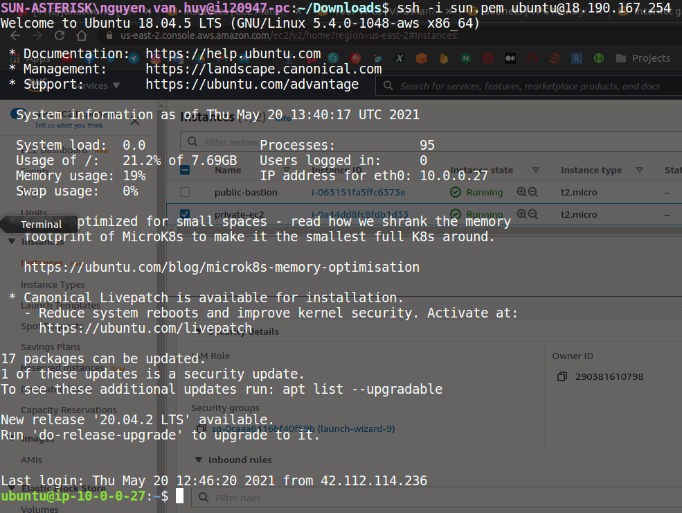

* ping tới `private-ec2`:

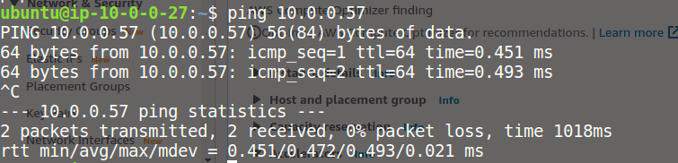
